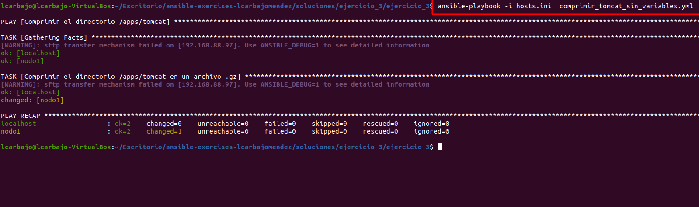
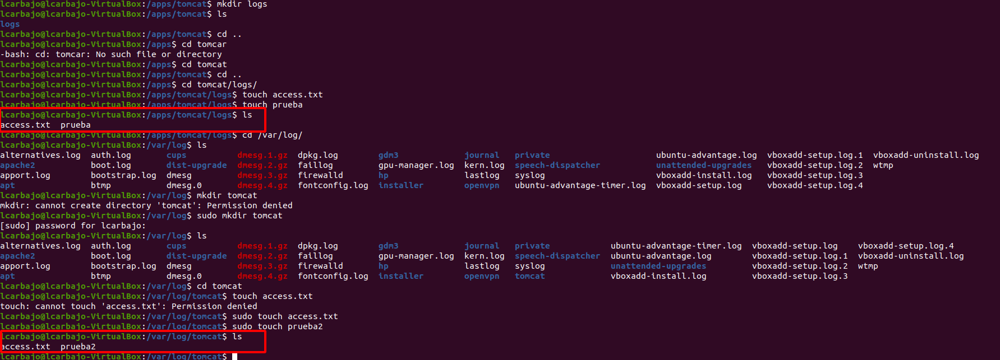
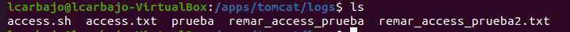
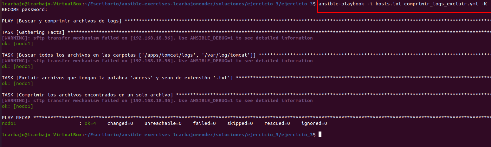
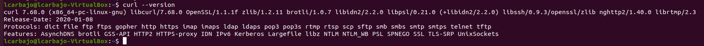

# Ejercicio 3: Uso de Módulos de Ansible

## Paso 1: Comprimir el Directorio `/apps/tomcat` en Formato gz

Antes de nada he intentado instalar `tomcat`, sin embargo, tras ciertos errores se nos has dicho que creemos una carpeta ficticia simulando para comprimir. 

1. **Comprimir el directorio sin usar variables**:
    - Crea un playbook llamado `comprimir_tomcat_sin_variables.yml`.
    - Utiliza el módulo `archive` para comprimir el directorio `/apps/tomcat` en un archivo `.gz`.
  
    El archivo `comprimir_tomcat_sin_variables.yml` contendrá:

    ```bash
    - name: Comprimir el directorio /apps/tomcat
      hosts: all
      tasks:
        - name: Comprimir el directorio /apps/tomcat en un archivo .gz # Nombre de la tarea
          archive: # Nombre del módulo a usar 
            path: /apps/tomcat # Ruta del directorio a comprimir
            dest: /apps/tomcat_comprimido.tar.gz # Ruta del archivo de salida
            format: gz # Formato de compresión a usar (gz, bz2, etc.)
    ```
    En este archivo se define un playbook que comprimirá el directorio `/apps/tomcat` en un archivo `.gz` llamado `/apps/tomcat_comprimido.tar.gz`. Esto se logra con el comando `archive` que se utiliza para comprimir archivos y directorios. Para observar su funcionamiento ejecutamos `ansible-playbook -i hosts.ini  comprimir_tomcat_sin_variables.yml` mostrandosé lo siguiente:

    

    

2. **Comprimir el directorio usando variables**:
    - Crea un playbook llamado `comprimir_tomcat_con_variables.yml`.
    - Define una variable para la ruta del directorio y otra para el archivo comprimido.
    - Utiliza el módulo `archive` para comrpimir el directorio indicado.

    ```bash
    - name: Comprimir el directorio /apps/tomcat
      hosts: all
      become: yes
      vars: # Creación de las variables con la ruta
         ruta: /apps/tomcat
         dest: /apps/tomcat_comprimido.tar2.gz
     tasks:
        - name: Comprimir el directorio /apps/tomcat en un archivo .gz # Nombre de la tarea
        archive: # Nombre del módulo a usar 
            path: "{{ ruta }}"
            dest: "{{ dest }}"
            format: gz # Formato de compresión a usar (gz, bz2, etc.)
    ```
    Al igual que el caso anterior hacemos lo mismo, pero añadiendo el comando `vars` para definir las variables `ruta` y `dest` que se utilizarán en el módulo `archive`. Para observar su funcionamiento ejecutamos `ansible-playbook -i hosts.ini comprimir_tomcat_con_variables.yml` mostrandosé lo siguiente:

    

    


## Paso 2: Comprimir Archivos con Exclusiones

1. **Comprimir archivos excluyendo ciertos patrones**:
    - Crea un playbook llamado `comprimir_logs_excluir.yml`.
    - Utiliza el módulo `find` para localizar todos los archivos en las carpetas `/apps/tomcat/logs` y `/var/log/tomcat/`.
    - Excluye aquellos que tengan la palabra `access` y sean de extensión `.txt`.
    - Usa el módulo `archive` para comprimir los archivos encontrados.

    Antes de querer realizar este apartado, he decidido crear varias carpetas y archivos que simulen el contenido de `/apps/tomcat/logs` y `/var/log/tomcat/` para poder ejecutar el playbook y observar su funcionamiento. A lo largo de la práctica he ido añadiendo unos cuantos más.

      

      

    ```bash
    - name: Buscar y comprimir archivos de logs # Nombre de la tarea
      hosts: nodo1 # Host donde se ejecutará la tarea
      become: yes # Permisos de superusuario
      vars: # Variables para la tarea
        logs_directorios: # Directorios de logs a buscar
        - /apps/tomcat/logs 
        - /var/log/tomcat
        excluidos: "access.*\\.txt" # Archivos de logs a excluir 
        archivo_comprimidos: /apps/comprimido_logs.tar.gz # Archivo de logs comprimido
      tasks: # Tareas a ejecutar
        - name: Buscar todos los archivos en las carpetas {{ logs_directorios }} # Buscar archivos de logs
        find: # Módulo para buscar archivos
            paths: "{{ logs_directorios }}" # Directorios a buscar
            recurse: yes # Buscar en subdirectorios
            patterns: "*"  # Buscar todos los archivos
        register: logs_encontrados # Guardar los resultados en una variable

        - name: Excluir archivos que tengan la palabra 'access' y sean de extensión '.txt' # Excluir archivos de logs
      set_fact: # Módulo para establecer una variable
        logs_filtrados: "{{ logs_encontrados.files | rejectattr('path', 'search', excluidos) | list }}" # Filtrar los archivos

    - name: Comprimir los archivos encontrados en un solo archivo # Comprimir archivos de logs
      archive: # Módulo para comprimir archivos
        path: "{{ logs_filtrados | map(attribute='path') | list }}" # Archivos a comprimir
        dest: "{{ archivo_comprimidos }}" # Archivo de logs comprimido
        format: gz # Formato de compresión
    ```
    En este archivo `comprimir_logs_excluir.yml` se busca en los directorios `/apps/tomcat/logs` y `/var/log/tomcat` dentro de todos los archivos, se excluyen aquellos que tengan la palabra `access` y sean de extensión `.txt` y se comprimen los archivos encontrados en un archivo llamado `/apps/comprimido_logs.tar.gz`. Para buscar en los directorios y excluir los no deseados creamos diversas variables y las utilizamos en el módulo `find` y `set_fact` para filtrar los archivos usando el `find` para buscar los archivos y el `set_fact` para establecer una variable con los archivos encontrados y filtrados. Para comprimir los archivos encontrados creamos una tarea con el módulo `archive` y especificamos el archivo de logs comprimido.
    
    Para observar su funcionamiento ejecutamos `ansible-playbook -i hosts.ini comprimir_logs_excluir.yml -K` mostrandosé lo siguiente:

    

    Una vez ya realizado el comando, descomprimimos el archivo y vemos si ha cumplido los requisitos solicitados mostrando en las siguientes capturas las dos carpetas con aquellos archivos que cumplen. 

    

    


## Paso 3: Instalar Paquetes .deb
1. **Instalar un paquete `.deb` desde un archivo local**:
    - Crea un playbook llamado `instalar_paquete_local.yml`.
    - Usa el módulo `apt` o `dpkg` para instalar un paquete `.deb` que esté almacenado localmente.

    En este supuesto, he decidido descargar el `.deb` de Google Chrome para realizar la prueba situando el archivo en `/home/lcarbajo/Escritorio/google_chrome.deb`. El archivo `instalar_paquete_local.yml` es el siguiente para poder realizar esta instalación:

    ```bash
    - name: Instalar Google Chrome desde archivo .deb
      hosts: web
      become: yes
      tasks:
      - name: Instalar Google Chrome
        apt: # Instalar paquete
            deb: /home/lcarbajo/Escritorio/google_chrome.deb # Ruta del archivo .deb
            state: present # Estado del paquete
      ```

    Para ejecutar el playbook, ejecutamos `ansible-playbook -i hosts.ini instalar_paquete_local.yml -K` mostrandosé lo siguiente:

    

    Tras instalar lo deseado, podemos verificar que el paquete se ha instalado correctamente ejecutando el siguiente comando en el nodo 1 `dpkg -l | grep google-chrome-stable` o directamente en la propia máquina ejecutar el Google Chrome.

    

    


2. **Instalar un paquete desde Internet**:
    - Crea un playbook llamado `instalar_paquete_internet.yml`.
    - Utiliza el módulo `apt` para instalar un programa disponible en los repositorios de Internet, como `htop` o `curl`.

    Sería similar al caso anterior, pero centrado en buscar los paquetes vía Internet por lo que no debemos pasar ninguna ruta y solo debemos especificar el nombre del paquete que deseamos instalar. El archivo `instalar_paquete_internet.yml` es el siguiente para poder realizar esta instalación:

    ```bash
    - name: Instalar paquetes desde Internet
      hosts: web 
      become: yes
      tasks:
        - name: Actualizar la lista de paquetes
          apt: # Paquete de gestión de paquetes de Debian 
            update_cache: yes # Actualiza la lista de paquetes

        - name: Instalar htop
          apt: # Comando en este caso usado para instalar paquetes
            name: htop # Paquete a instalar
            state: present # Estado del paquete (present, absent, latest)

        - name: Instalar curl
          apt: # Comando en este caso usado para instalar paquetes
            name: curl # Paquete a instalar
            state: present # Estado del paquete (present, absent, latest)
    ```
    Este playbook busca actualizar la lista de paquetes con `update_cache: yes`, instalar `htop` y `curl` en el nodo 1 usando el comando `apt`. Para ejecutar el playbook, ejecutamos `ansible-playbook -i hosts.ini instalar_paquete_internet.yml -K` mostrandosé lo siguiente:

    

    Una vez realizamos el comando correspondiente, podemos verificar que el paquete se ha instalado correctamente ejecutando varios comandos, en mi caso he usado `htop` y `curl --version`. 

    

    
    
