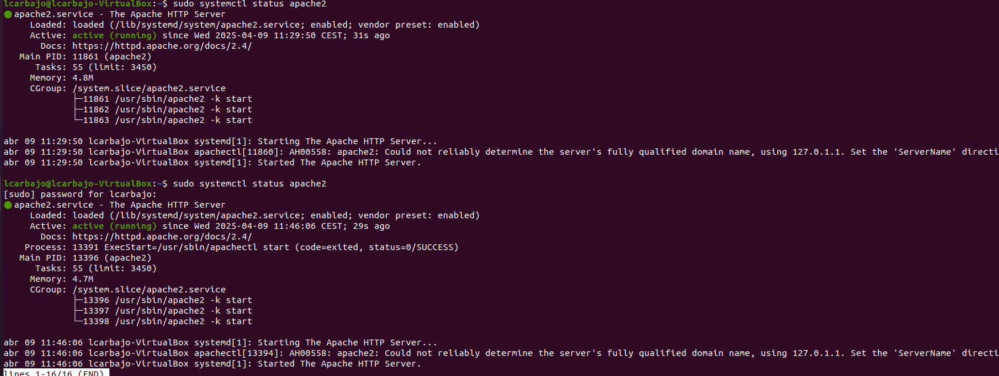

# Ejercicio 5: Imports y Handlers en Ansible

## Paso 1: Playbook de Instalación de Apache2

1.- Crea un playbook que simplemente realice la instalación de apache2

He decidido crear el playbook llamado `instalacion_apache.yml` con el siguiente contenido:

```bash
- name: Instalar Apache2
  hosts: web
  become: yes 
  tasks:
    - name: Instalar Apache2
      apt: # Instalar paquete
        name: apache2
        state: present
```
Es algo simple donde se solicita la instalación del paquete apache2, en mi caso al estar ya instalado no tarda tanto porque no se ejecuta como tal la instalación. Por ende, he decidido desinstalarlo y volverlo a instalar. Para su funcionamiento, ejecutamos el comando `ansible-playbook -i hosts.ini instalacion_apache.yml -K` y saldrá lo siguiente:


## Paso 2: Reutilizar el Playbook de Instalación de Apache2

1.- Modifica tu playbook existente de instalación de Apache2 para incluir un paso adicional que permita iniciar el servicio.

2.- Crea un nuevo playbook que haga uso del `import_playbook` para llamar al playbook de instalación y arranque del servicio.

Primero modificamos el playbook anterior para que incluya el arranque del servicio apache2. Para ello, debemos agregar el siguiente bloque de código:

```bash
 - name: Iniciar el servicio de Apache2
      service: # Iniciar servicio
        name: apache2
        state: started # Iniciar el servicio
        enabled: yes # Habilitar el servicio para que se inicie automáticamente al iniciar el sistema
```
Con este trozo de código agregamos el servicio de apache y le decimos que se inicie con `started` y que se active para que se inicie automáticamente al iniciar el sistema con `enabled: yes`. Tras ello, creamos un nuevo playbook llamado `playbook_importado.yml` donde importaremos el playbook anterior con el siguiente contenido:

```bash
- name: Importar playbook de instalación y arranque de Apache2
  import_playbook: instalacion_apache.yml # nombre del archivo de playbook a importar
```
Para ejecutarlo usamos el comando `ansible-playbook -i hosts.ini playbook_importado.yml -K` y saldrá lo siguiente:


Y para mostrar el funcionamiento de apache2 con `sudo systemctl status apache2` y saldrá lo siguiente:


## Paso 3: Reiniciar el Servicio Apache2 al Modificar su Configuración

1.- Crea un handler en Ansible que se encargue de reiniciar el servicio Apache2.

2.- Ajusta tu playbook para que, si se modifica la configuración de Apache2, se notifique al handler para reiniciar el servicio automáticamente.

En primer lugar, creamos el `handler` correspondiente en el playbook `hadler2.yml` donde se añadirá a los anteriores el comando ` handlers` mostrando sus datos correspondientes. Una vez hecho esto pasamos al punto segundo donde modificaré para que se notifique al handler cuando se da un cambio a través de copiar un nuevo archivo de apache en su carpeta. El playbook final con todos los datos será el siguiente:

```bash
- name: Instalar, iniciar Apache2 y Handler
  hosts: web
  become: yes
  tasks:
    - name: Instalar el paquete apache2
      apt:
        name: apache2
        state: present

    - name: Iniciar el servicio de Apache2
      service:
        name: apache2 # nombre del servicio
        state: started # estado del servicio
        enabled: yes # Para que se ejecute al iniciar el sistema

    - name: Modificar configuración de Apache2
      copy: # copiar archivo de configuración
        src: /home/lcarbajo/Escritorio/apache2.conf # ruta del archivo a copiar
        dest: /etc/apache2/apache2.conf # ruta del archivo destino
        remote_src: yes # indica que el archivo a copiar está en un servidor remoto
      notify: Reiniciar el servicio de Apache2 # indica que se debe reiniciar el servicio después de realizar la tarea

  handlers: # Manejadores de eventos
    - name: Reiniciar el servicio de Apache2
      service: # El servicio que se va a reiniciar
        name: apache2 # nombre del servicio
        state: restarted # estado del servicio
```
Tanto la primera como la segunda tarea la hemos visto anteriormente por lo que me centraré en los eventos nuevos. En primera instancia, se crea otra tarea que copiará el archivo de configuración de Apache2 del escritorio a la carpeta de Apache2. En segundo lugar, se crea un manejador de eventos que se encargará de reiniciar el servicio Apache2 cada vez que se modifique la configuración notificándose ello a través del comando `notify` que se encuentra en la tarea de copiar el archivo de configuración.

Ejecutamos el comando `ansible-playbook -i hosts.ini hadler2.yml -K` y saldrá lo siguiente:


Aquí vemos un ejemplo del estado Apache2 cuando ejecutamos el comando reiniciando el servicio por la modificación dada.




## Paso 4: Crear un Playbook para Limpiar Dependencias y Cache

1.- Crea un playbook llamado `limpiar_dependencias.yml` que limpie las dependencias y la caché del sistema.

2.- Crea un segundo playbook que haga uso del `import_playbook` para llamar al playbook `limpiar_dependencias.yml`.

Creamos el playbook `limpiar_dependencias.yml` con el siguiente contenido:

```bash
- name: Limpiar dependencias y caché del sistema
  hosts: web
  become: yes
  tasks:
    - name: Limpiar paquetes no necesarios
      apt: # Instalar paquetes
        autoremove: yes # Eliminar paquetes no necesarios
        autoclean: yes # Eliminar paquetes no necesarios y limpiar el caché
        update_cache: yes # Actualizar el caché de paquetes

    - name: Limpiar caché de apt # Eliminar el caché de apt
      command: apt-get clean # Eliminar el caché de apt
```
En este playbook, se utiliza el modulo `apt` para limpiar los paquetes no necesarios y el caché de paquetes. Además, se utiliza el comando `apt-get clean` para eliminar el caché de apt. Luego, creamos el segundo playbook llamado `limpiar_dependencias2.yml` con el siguiente contenido:

```bash
- name: Ejecutar limpieza del sistema
  import_playbook: limpiar_dependencias.yml
```
Lo ejecutamos con el comando `ansible-playbook -i hosts.ini playblook_importado_limpieza.yml -K` mostrando el siguiente resultado:


Y tras ello lo comprobamos con el comando `sudo apt autoremove` para ver que efectivamente se han eliminado los paquetes no necesarios mostrando el siguiente resultado:

