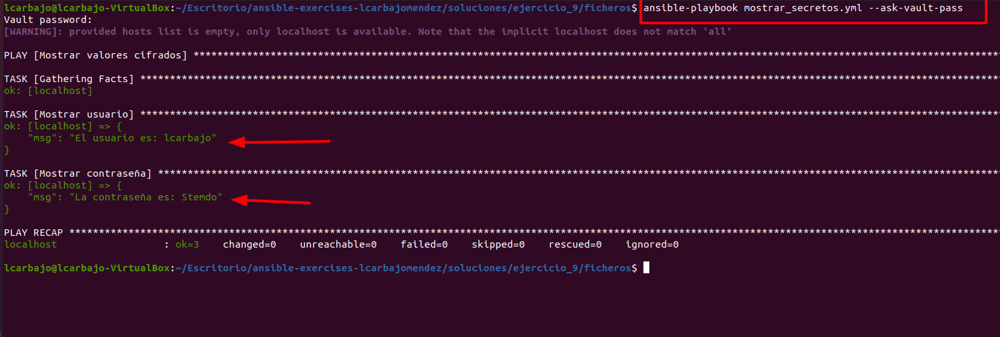

# Ejercicio 9

1. Crear un archivo de secretos
  - Crea un archivo llamado ``missecretos.yml`` que contenga dos variables:
    - ``miuser``: para almacenar un nombre de usuario.
    - ``micontra``: para almacenar una contraseña.

    Tal y como se nos comenta en este apartado, pasamos a la creación de un archivo donde guardamos las variables correspondiente:

    ```bash
    miuser: lcarbajo
    micontra: Stemdo
    ```

2. Cifrar con Ansible Vault
  - Utiliza Ansible Vault para cifrar el archivo ``missecretos.yml`` y proteger el contenido de las variables.

    A través del comando `ansible-vault encrypt missecretos.yml` ciframos el archivo creado anteriormente solicitando este una contraseña para cifrar el archivo por parte de Vault. La contraseña estipulada ha sido `1111`. Tras ese cifrado, el archivo `missecretos.yml` se convierte en un archivo cifrado.

    

    ```bash
      $ANSIBLE_VAULT;1.1;AES256
      62636465313933363135643161646638616438333331656438303832316665313763623231663766
      6533343965326630323630623639303731396632626661360a623863366562333236356563313361
      39346661343466663965616138666462353764346463396332333766306261326333396536366231
      3963353836613437640a666562323830396161393634346537653762353566646131386235636462
      65373335666663663631326663663431643433323337383565346538616231343839303936356232
      3032313937666234383966613362316565356166646432666238
    ```

3. Crear un Playbook
  - Escribe un playbook que:
    - Incluya el archivo cifrado ``missecretos.yml``.
    - Tenga una tarea que muestre el valor de las variables ``miuser`` y ``micontra`` en la salida.

4. Ejecutar el Playbook
  - Ejecuta el playbook, asegurándote de que Ansible Vault solicite la contraseña de desencriptación y muestre los valores correctos de las variables.

    Como ambos puntos van a la par, vamos a realizarlos de manera conjunta. Primero, creamos el playbook que se encargará de desencriptar el archivo y mostrar los valores de las variables. El archivo se llama `mostrar_secretos.yml` y contiene el siguiente contenido:

    ```bash
    - name: Mostrar valores cifrados
      hosts: localhost
      vars_files:
        - missecretos.yml # Variable que recoge las variables del archivo
      tasks:
        - name: Mostrar usuario
          debug:
            msg: "El usuario es: {{ miuser }}" # Muestra el valor de la variable usuario
        - name: Mostrar contraseña
          debug:
            msg: "La contraseña es: {{ micontra }}" # Muestra el valor de la variable contraseña
    ```
    El archivo simplemente recoge el archivo cifrado `missecretos.yml` y muestra los valores de las variables `miuser` y `micontra` a través de la tarea `debug`. Posteriormente, ejecutamos el playbook con el comando `ansible-playbook mostrar_secretos.yml --ask-vault-pass` y se nos solicita la contraseña para desencriptar el archivo. Tras la introducción de la contraseña, se nos muestra el contenido del archivo cifrado. La parte `--ask-vault-pass` del comando nos asegura que Ansible te solicite la contraseña de desencriptación. Aquí una muestra de la salida:

    

